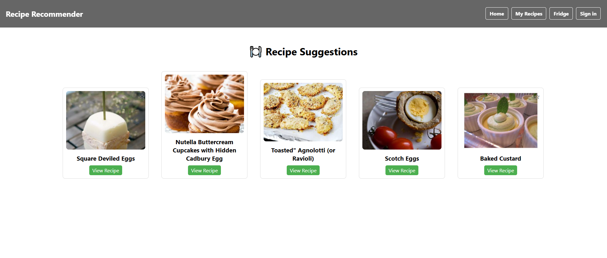
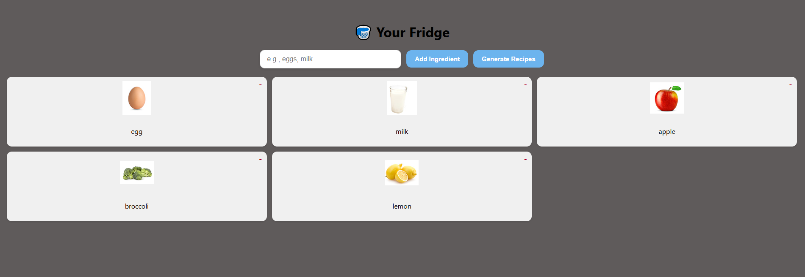

# 🥘 AutoCooker - Recipe Recommendations

AutoCooker is a smart web app that helps you decide what to cook based on the ingredients you already have. No more Googling “what to make with eggs and rice” — just enter your ingredients and get personalized recipe suggestions in seconds!

---

## 🔗 Live Demo

👉 [Try AutoCooker now](https://recipes-for-days.netlify.app)

> ⚠️ Make sure to register/login to favorite recipes and save your ingredients!

---

## 📸 Screenshot

  
  
*A preview of how AutoCooker recommends recipes from user-submitted ingredients.*

---

## ✨ Features

- 🧠 Smart recipe matching using Spoonacular API
- 👤 User authentication (register/login)
- 🧺 Add or remove ingredients dynamically
- 💾 Save and view your personal recipe suggestions
- 🔄 Fast, responsive frontend built in React
- ⚙️ Backend powered by FastAPI + PostgreSQL

---

## 🛠️ Tech Stack

| Layer      | Technology                      |
|------------|----------------------------------|
| Frontend   | React                            |
| Backend    | FastAPI, PostgreSQL              |

---